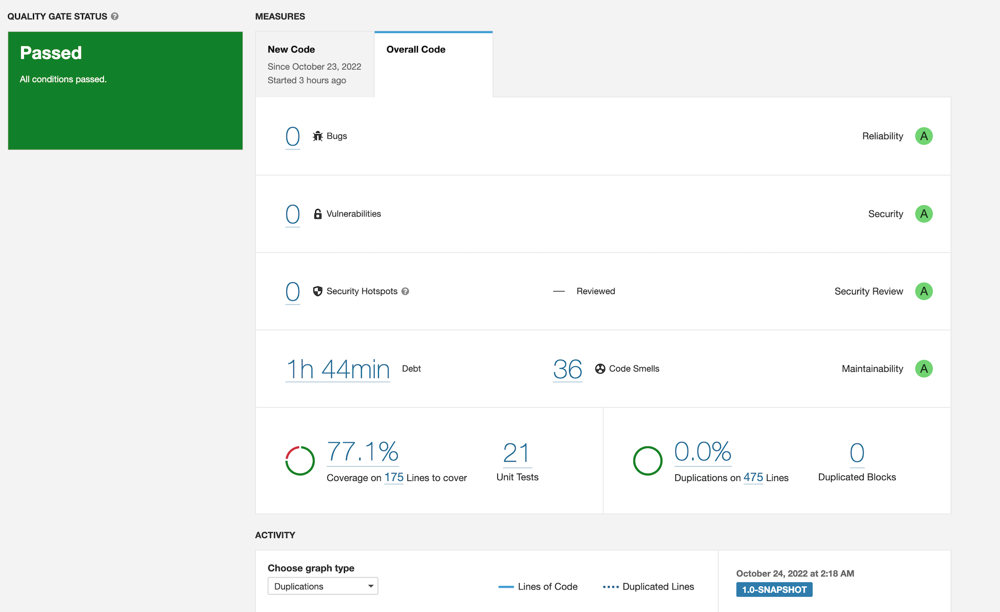

## Description and requirements
The application is a simulation of a toy robot moving on a square table-top, of dimensions 5 units x 5 units. There are no
other obstructions on the table surface. The robot is free to roam around the surface of the table, but must be prevented
from falling to destruction. Any movement that would result in the robot falling from the table must be prevented,
however further valid movement commands must still be allowed.

## Operating Mode
* PLACE will put the toy robot on the table in position X,Y and facing NORTH, SOUTH, EAST or WEST. 
* The origin (0,0) can be considered to be the SOUTH WEST most corner. 
* It is required that the first command to the robot is a PLACE command, after that, any sequence of commands may be issued, in any order, including another PLACE command. 
* The application should discard all commands in the sequence until a valid PLACE command has been executed. 
* MOVE will move the toy robot one unit forward in the direction it is currently facing. 
* LEFT and RIGHT will rotate the robot 90 degrees in the specified direction without changing the position of the
robot. 
* REPORT will announce the X,Y and F of the robot. This can be in any form, but standard output is sufficient. 
* A robot that is not on the table can choose to ignore the MOVE, LEFT, RIGHT and REPORT commands. 
* Input is from standard input. 
* The application should handle error states appropriately and be robust to user input.

##Constraints
The toy robot must not fall off the table during movement. This also includes the initial placement of the toy robot. Any
move that would cause the robot to fall must be ignored.

##  Valid Commands
* PLACE X,Y,F
* MOVE
* LEFT
* RIGHT
* REPORT
* EXIT

## Test Data and Output
1. First test case
   * PLACE 0,0,NORTH
   * MOVE
   * REPORT
*Output: 0,1,NORTH*

2. Second test case
   * PLACE 0,0,NORTH
   * LEFT
   * REPORT
*Output: 0,0,WEST*

3. Third test case
   * PLACE 1,2,EAST
   * MOVE
   * MOVE
   * LEFT
   * MOVE
   * REPORT
*Output: 3,3,NORTH*

## Code Statistics
 "Code smells are due to public test classes and usage of System.out.print instead of loggers"

## Requirements
* Implemented and tested using Java 11 
* Tests require JUnit 5.9.0, jacoco 0.8.6
* Code quality and security check SonarQube plugin version 3.9.1.2184; please ensure sonarQube server is running
* Dependencies and compiling managed by Maven

## Compile, Test, Run and Packaging
* Test: mvn clean test
* mvn sonar:sonar -Dsonar.login=<auth token>
* Run: mvn exec:java
* Compile: mvn compile
* Packaging: mvn package, create jar in target folder